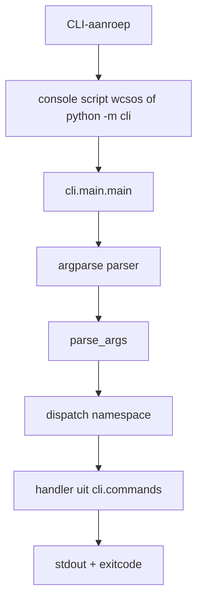

# Minimale CLI-runtime scaffold voor Webcraft Studios OS v1

## Executive summary

Voor de eerste upload adviseer ik een **stdlib-first Python-CLI** met `argparse`, een **root-level `cli/` package**, een moderne **`pyproject.toml`** en één console script **`wcsos`** dat verwijst naar `cli.main:main`. Dat sluit aan op de officiële Python-aanpak voor gebruiksvriendelijke CLI’s, op `argparse`-subcommands via `add_subparsers()` plus `set_defaults()`, en op het huidige PyPA-packagingmodel met `[project.scripts]`, dat een uitvoerbaar script aanmaakt en de retourwaarde van `main()` als exitcode gebruikt. citeturn4view0turn6view0turn6view7turn5view1turn9search2

Omdat de PyPA-documentatie aangeeft dat een **flat layout** direct vanuit de bronboom uitvoerbaar is, terwijl een **src-layout** typisch eerst installatie vraagt, is een root-level `cli/` package hier de snelste weg naar “uploaden en meteen testen”. Tegelijk laat setuptools zien dat flat layout extra voorzichtigheid vraagt bij package discovery; daarom raad ik expliciete discovery aan met `include = ["cli*"]` en `namespaces = false`, zodat je geen onbedoelde pakketten meeneemt. citeturn4view2turn15view0

Voor testen is een kleine `tests/` map met **pytest** voldoende: één unit test voor dispatch/uitvoer en één subprocess-smoke test via `python -m cli --help`. Pytest ondersteunt projectconfiguratie in `pyproject.toml`; voor brede compatibiliteit is `[tool.pytest.ini_options]` praktischer dan het nieuwere `[tool.pytest]`, dat pas in pytest 9 native TOML-typen gebruikt. citeturn11view0turn5view2

**Click** blijft een goede tweede stap wanneer je later rijkere UX, decorator-based commands, context-objecten, prompts of ingebouwde CLI-testhelpers wilt. Voor deze v1 voegt het echter een extra runtime dependency toe zonder dat het een direct probleem oplost dat `argparse` hier niet al voldoende afdekt. citeturn10search0turn10search1turn4view5turn5view4

## Primaire bevindingen

`pyproject.toml` is vandaag het centrale configuratiebestand voor packaging-tools. De `[build-system]`-tabel wordt expliciet aanbevolen, de `[project]`-tabel draagt de pakketmetadata, en `[project.scripts]` is de moderne manier om uitvoerbare commando’s te declareren. Binnen de entry-pointspecificatie correspondeert `[project.scripts]` met de `console_scripts`-groep. citeturn5view0turn6view7turn9search2

Voor de CLI-implementatie is `argparse` de best passende basis. De Python-documentatie noemt het de aanbevolen command-line parsing module in de standaardbibliotheek. Voor een kleine command dispatcher is de combinatie van `add_subparsers()` en `set_defaults()` idiomatisch, omdat elk subcommando zo zijn eigen handler meekrijgt zonder extra frameworklaag. citeturn5view5turn6view0

Naast het geïnstalleerde console script is een minimale `__main__.py` zinvol. De Python-documentatie legt uit dat `__main__.py` wordt uitgevoerd wanneer een package met `python -m package` gestart wordt, en beveelt aan zo’n bestand klein te houden en echte logica in testbare modules onder te brengen. Dat maakt `python -m cli` meteen bruikbaar in de bronboom. citeturn7view2

Voor lokale ontwikkeling is **editable install** de juiste default. Pytest beveelt een virtuele omgeving plus `pip` aan, en PyPA/setuptools documenteren dat `python -m pip install -e .` bronwijzigingen zonder herinstallatie laat meereizen en tegelijk gedeclareerde scripts installeert. Extras kunnen vanuit de huidige directory mee geïnstalleerd worden, wat de dev-extra voor pytest praktisch maakt. citeturn4view3turn4view7turn13search2turn13search5

## Aanbevolen ontwerp

Ik raad voor deze eerste versie het volgende pad aan: **houd de repository plat**, voeg **`pyproject.toml`** toe voor packaging en tests, plaats de CLI-code in **`cli/`** op repo-root, en beperk de eerste command tot een **side-effect-vrije no-op**. Dat geeft je meteen drie execution paths: direct uit de bronboom via `python -m cli`, als module via `python -m cli.main`, en als geïnstalleerd commando via `wcsos`. Die combinatie levert snelle feedback op zonder het project al in een zwaardere packagingstructuur te duwen. citeturn4view2turn7view2turn6view7turn14search3

De voorgestelde lay-out is:

```text
webcraft-studios-os/
├── AGENTS.md
├── README.md
├── .gitignore
├── pyproject.toml
├── cli/
│   ├── __init__.py
│   ├── __main__.py
│   ├── commands.py
│   └── main.py
├── docs/
├── examples/
├── prompts/
└── tests/
    ├── test_commands.py
    └── test_smoke.py
```

De interne scheiding is bewust eenvoudig: **`cli/main.py`** bevat parser, subcommands en dispatch; **`cli/commands.py`** bevat alleen commandlogica; **`cli/__main__.py`** is de dunne `python -m`-ingang. Dat past zowel bij Python’s advies rond `__main__.py` als bij de `argparse`-aanpak waarbij de parser een handler aan een subcommand koppelt. Omdat `console_scripts`/`project.scripts` een functie zonder argumenten aanroepen en een integer retourwaarde als exitcode kunnen gebruiken, is een `main(argv=None) -> int`-vorm hier een nette basis. citeturn7view2turn6view0turn5view1

De dispatcherstroom ziet er dan zo uit:



## Concrete bestanden

Hieronder staan de **nieuwe of gewijzigde bestanden** die je nodig hebt voor een eerste, testbare upload. `pyproject.toml` centraliseert build metadata, scripts en pytest-instellingen; `cli/main.py` houdt parser en dispatch samen; `cli/commands.py` bevat de side-effect-vrije commandlogica; `__main__.py` maakt `python -m cli` mogelijk; en pytest ontdekt standaardbestanden zoals `test_*.py`. citeturn5view0turn6view7turn7view2turn5view2turn11view0

**`pyproject.toml`**

```toml
[build-system]
requires = ["setuptools>=68"]
build-backend = "setuptools.build_meta"

[project]
name = "webcraft-studios-os"
version = "0.1.0"
description = "Minimale CLI-runtime voor Webcraft Studios OS."
readme = "README.md"
requires-python = ">=3.10"
dependencies = []

[project.optional-dependencies]
dev = ["pytest>=8,<10"]

[project.scripts]
wcsos = "cli.main:main"

[tool.setuptools.packages.find]
where = ["."]
include = ["cli*"]
namespaces = false

[tool.pytest.ini_options]
minversion = "8.0"
addopts = "-ra -q"
testpaths = ["tests"]
```

**`.gitignore`**

```gitignore
# Python
__pycache__/
*.py[cod]
.venv/
.pytest_cache/
dist/
build/
*.egg-info/

# Node
node_modules/

# OS
.DS_Store

# Logs
*.log

# Env
.env
```

**`cli/__init__.py`**

```python
"""CLI package voor Webcraft Studios OS."""

__all__ = ["__version__"]

__version__ = "0.1.0"
```

**`cli/__main__.py`**

```python
from .main import main

raise SystemExit(main())
```

**`cli/main.py`**

```python
from __future__ import annotations

import argparse
from collections.abc import Sequence

from . import commands


def build_parser() -> argparse.ArgumentParser:
    parser = argparse.ArgumentParser(
        prog="wcsos",
        description="Minimale CLI-runtime voor Webcraft Studios OS.",
    )

    subparsers = parser.add_subparsers(dest="command", required=True)

    init_sprint_parser = subparsers.add_parser(
        "init-sprint",
        help="Initialiseer een sprint in no-op modus.",
        description="Valideer sprint-input zonder bestanden te wijzigen.",
    )
    init_sprint_parser.add_argument(
        "--name",
        default="unnamed-sprint",
        help="Naam van de sprint.",
    )
    init_sprint_parser.add_argument(
        "--goal",
        default="",
        help="Korte doelomschrijving voor de sprint.",
    )
    init_sprint_parser.set_defaults(handler=commands.init_sprint)

    return parser


def dispatch(args: argparse.Namespace) -> int:
    handler = getattr(args, "handler", None)
    if handler is None:
        raise SystemExit(2)

    result = handler(args)
    return 0 if result is None else int(result)


def main(argv: Sequence[str] | None = None) -> int:
    parser = build_parser()
    args = parser.parse_args(argv)
    return dispatch(args)


if __name__ == "__main__":
    raise SystemExit(main())
```

**`cli/commands.py`**

```python
from __future__ import annotations

import argparse
import json


def init_sprint(args: argparse.Namespace) -> int:
    goal = args.goal.strip() if args.goal else ""
    payload = {
        "command": "init-sprint",
        "mode": "noop",
        "name": args.name,
        "goal": goal or "Nog geen doel opgegeven.",
        "writes_files": False,
        "status": "gepland",
    }

    print("[noop] init-sprint uitgevoerd zonder schrijfacties.")
    print(json.dumps(payload, indent=2, ensure_ascii=False))
    return 0
```

**`tests/test_commands.py`**

```python
from cli.main import build_parser, dispatch


def test_init_sprint_dispatch_returns_zero_and_prints_payload(capsys):
    parser = build_parser()
    args = parser.parse_args(
        ["init-sprint", "--name", "CLI scaffold", "--goal", "Dispatcher testen"]
    )

    exit_code = dispatch(args)
    captured = capsys.readouterr()

    assert exit_code == 0
    assert "[noop] init-sprint" in captured.out
    assert '"command": "init-sprint"' in captured.out
    assert '"name": "CLI scaffold"' in captured.out
    assert '"writes_files": false' in captured.out


def test_init_sprint_uses_default_name(capsys):
    parser = build_parser()
    args = parser.parse_args(["init-sprint"])

    exit_code = dispatch(args)
    captured = capsys.readouterr()

    assert exit_code == 0
    assert '"name": "unnamed-sprint"' in captured.out
```

**`tests/test_smoke.py`**

```python
from __future__ import annotations

import subprocess
import sys
from pathlib import Path


PROJECT_ROOT = Path(__file__).resolve().parents[1]


def test_cli_help_smoke():
    result = subprocess.run(
        [sys.executable, "-m", "cli", "--help"],
        cwd=PROJECT_ROOT,
        capture_output=True,
        text=True,
        check=False,
    )

    assert result.returncode == 0
    assert "init-sprint" in result.stdout
    assert "Minimale CLI-runtime" in result.stdout
```

**`README.md`**

````markdown
# Webcraft Studios OS

Webcraft Studios OS is de orkestratielaag voor gestructureerde multi-agent ontwikkeling.

## Doel

Deze repository bevat de basisstructuur, guardrails en een minimale CLI-runtime om sprints gecontroleerd te starten en lokaal te testen.

## Repository-structuur

```text
webcraft-studios-os/
├── AGENTS.md
├── README.md
├── .gitignore
├── pyproject.toml
├── cli/
│   ├── __init__.py
│   ├── __main__.py
│   ├── commands.py
│   └── main.py
├── docs/
├── examples/
├── prompts/
└── tests/
    ├── test_commands.py
    └── test_smoke.py
```

## Vereisten

- Python 3.10 of nieuwer
- `pip`
- Een virtuele omgeving wordt aanbevolen

## Installatie voor lokaal testen

```bash
python -m venv .venv
source .venv/bin/activate
# Windows PowerShell: .venv\Scripts\Activate.ps1

python -m pip install -e ".[dev]"
```

## Gebruik

Direct vanuit de bronboom:

```bash
python -m cli --help
python -m cli init-sprint --name "CLI scaffold" --goal "Eerste lokale test"
```

Via het geïnstalleerde console script:

```bash
wcsos --help
wcsos init-sprint --name "CLI scaffold" --goal "Eerste lokale test"
```

## Testen

```bash
pytest
pytest tests/test_smoke.py -q
```

## CLI-status

De command `init-sprint` is in v1 bewust een no-op. De command valideert argumenten en toont een gestructureerde payload, maar schrijft nog geen bestanden weg.

## Veilig uitbreiden

- Houd parserlogica in `cli/main.py`
- Houd commandlogica in `cli/commands.py`
- Voeg per nieuwe command minstens één unit test toe
- Werk `README.md` en `AGENTS.md` mee bij als gedrag of entry points veranderen
````

**`AGENTS.md`**

```markdown
# AGENTS.md

Deze repository gebruikt Webcraft Studios OS-regels voor georkestreerde ontwikkeling.

## Globale regels

- Wijzig nooit bestanden buiten de expliciete sprintscope.
- Gebruik nooit `git add .`.
- Declareer altijd classificatie, scope, validatie en verwachte bestandswijzigingen.
- Beperk vroege sprints tot kleine, traceerbare veranderingen.

## Agentrollen

- Project Navigator Agent
- Sprint Controller Agent
- Coding Agent
- Test & Validation Agent
- Git Instructor Agent
- Prompt Architect Agent
- Documentation Agent
- Architecture Agent

## CLI-regels

- CLI-sprints mogen standaard alleen deze paden wijzigen: `cli/`, `tests/`, `pyproject.toml`, `README.md`, `AGENTS.md` en `.gitignore`.
- Gebruik standaard `argparse`; voeg `click` alleen toe wanneer een sprint dat expliciet motiveert en goedkeurt.
- `cli/main.py` bevat parser, entry point en dispatcher.
- `cli/commands.py` bevat commandlogica.
- Commands zijn side-effect-vrij tenzij de sprint expliciet schrijfacties toestaat.
- Elke nieuwe command moet een helptekst, minstens één unit test en een README-voorbeeld hebben.
- Wijzigingen aan het console script of entry points vereisen een gelijktijdige update van `pyproject.toml` en `README.md`.

## Veiligheidsprincipe

Bij twijfel:
- verklein de scope
- vermijd refactors
- vermijd verborgen neveneffecten
- valideer lokaal vóór commit
```

## argparse versus click

De vergelijking hieronder vat de relevante verschillen samen op basis van de officiële Python-, Click- en pytest-documentatie. citeturn5view5turn4view0turn4view5turn10search1turn5view4

| Aspect | `argparse` | `click` | Advies voor deze v1 |
|---|---|---|---|
| Runtime-afhankelijkheden | Onderdeel van de Python-standaardbibliotheek; geen extra runtime package nodig. | Extra package dat expliciet geïnstalleerd moet worden. | Kies `argparse` om de eerste upload dependency-arm te houden. |
| Commandmodel | Subcommands via `add_subparsers()`; handlers elegant via `set_defaults()`, maar iets meer boilerplate. | Decorator-based commands en groups; doorgaans minder code voor rijke CLI’s. | `argparse` is voldoende voor één dispatcher en één no-op command. |
| Help en validatie | Automatische help, usage en foutmeldingen ingebouwd. | Ook automatische help; Click stuurt sterker op consistente help-output en CLI-conventies. | Geen duidelijke meerwaarde van Click in deze eerste stap. |
| Groeipad | Goed voor kleine tot middelgrote CLI’s zonder extern framework. | Sterk in composability, nested groups, contexts en latere UX-uitbreidingen. | Overweeg Click pas zodra je meerdere commandgroepen of interactieve flows krijgt. |
| Teststrategie | Testbaar met gewone functies, `pytest`, `capsys` en `subprocess`. | Heeft extra testhelpers zoals `CliRunner`. | Voor v1 volstaat standaard `pytest` ruimschoots. |

Mijn conclusie is daarom: **implementeer nu `argparse`**, en hou Click hoogstens als latere optionele migratie of extra wanneer je interactieve prompts, context propagation of zwaardere command-compositie nodig hebt. Als je die stap later zet, is het verstandig Click niet meteen in de standaardinstallatie te trekken maar als expliciete extra of gerichte sprintbeslissing te behandelen. citeturn6view0turn10search1turn5view4turn6view6turn13search3

## Lokale test- en gitprocedure

Voor lokaal testen is een editable install de juiste manier: pip ondersteunt editable installs voor lokale projecten, extras kunnen mee geïnstalleerd worden vanuit de huidige directory, en setuptools/PyPA documenteren dat gedeclareerde scripts dan beschikbaar komen terwijl bronwijzigingen zonder herinstallatie weerspiegeld worden. citeturn13search2turn13search5turn4view7turn12view0

Gebruik lokaal deze commando’s:

```bash
python -m venv .venv
source .venv/bin/activate
# Windows PowerShell: .venv\Scripts\Activate.ps1

python -m pip install -e ".[dev]"

python -m cli --help
python -m cli init-sprint --name "Repo v1" --goal "Eerste smoke test"

wcsos --help
wcsos init-sprint --name "Repo v1" --goal "Eerste smoke test"

pytest
pytest tests/test_smoke.py -q
```

Controleer lokaal minstens dit voordat je commit:

- [ ] `python --version` geeft Python 3.10 of nieuwer
- [ ] de virtuele omgeving is actief
- [ ] `python -m pip install -e ".[dev]"` slaagt
- [ ] `python -m cli --help` toont `init-sprint`
- [ ] `wcsos --help` werkt na editable install
- [ ] `pytest` slaagt
- [ ] `git diff --staged` bevat alleen bedoelde wijzigingen

Veilige `git add`- en commitstappen voor deze wijziging:

```bash
git add pyproject.toml
git add .gitignore
git add cli/__init__.py cli/__main__.py cli/main.py cli/commands.py
git add tests/test_commands.py tests/test_smoke.py
git add README.md AGENTS.md

git status
git diff --staged
git commit -m "Add minimal argparse CLI scaffold"
```

Als je remote al gekoppeld is, kun je daarna pushen met:

```bash
git push -u origin main
```

## Bronnen

De belangrijkste primaire bronnen voor dit advies en deze implementatie zijn de officiële documentatie van Python, PyPA, setuptools, pytest en Click:

- Python `argparse` reference en tutorial. citeturn4view0turn5view5turn6view0
- Python `__main__` en package-entry gedrag. citeturn4view6turn7view2
- PyPA over `pyproject.toml`, `[project.scripts]`, entry points en flat versus src layout. citeturn5view0turn6view7turn5view1turn9search2turn4view2
- setuptools over entry points en gecontroleerde package discovery in flat layout. citeturn14search3turn15view0
- pytest over configuratie, discovery en integratiepraktijken. citeturn11view0turn5view2turn4view3
- Click over command groups, motivatie en testhelpers als latere alternatieve richting. citeturn10search1turn4view5turn5view4turn12view0