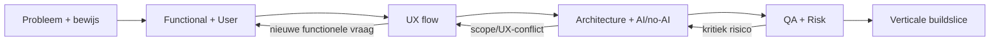

# [Appnaam] — Project Hub

> Centrale index en actuele status van het appdesign. Detail hoort in de gelinkte notes.

## Status

- **Fase:** discovery | design | architecture | build-ready | build
- **Product gate:** RED | AMBER | GREEN
- **Interaction gate:** RED | AMBER | GREEN
- **Architecture gate:** RED | AMBER | GREEN
- **Build gate:** RED | AMBER | GREEN
- **Laatste belangrijke wijziging:** YYYY-MM-DD

## Kern

**Probleem in één zin**  
...

**Primaire gebruiker/doelgroep**  
...

**Huidige workaround**  
...

**Gewenste uitkomst**  
...

**Waarom adoptie/betaling logisch kan zijn**  
...

**Kerngebruikerstaak**  
...

**Huidige kleinste bruikbare/verkoopbare versie**  
...

## Bewijsstatus

### Bevestigd
- ...

### Hypotheses
- ...

### Nog te bewijzen
- ...

## Grootste open onzekerheden

1. ...
2. ...
3. ...

## Workspace

Gebruik echte HackMD-links zodra de notes bestaan.

- [Product & Validation](PASTE-HACKMD-LINK)
- [Functional Model](PASTE-HACKMD-LINK)
- [User Research](PASTE-HACKMD-LINK)
- [User Flows & UX](PASTE-HACKMD-LINK)
- [Screen Blueprint](PASTE-HACKMD-LINK)
- [Solution Architecture](PASTE-HACKMD-LINK)
- [AI & Automation](PASTE-HACKMD-LINK)
- [QA & Risks](PASTE-HACKMD-LINK)
- [Build Plan](PASTE-HACKMD-LINK)
- [Decision Log](PASTE-HACKMD-LINK)

Maak niet alle notes vooraf als ze nog geen functie hebben. Voeg ze toe wanneer een specialistische vraag ontstaat.

## Actuele beslispunten

- [ ] ...

## Huidige non-scope

- ...

## Volgende specialistische vraag

**Agent:** ...  
**Vraag:** ...  
**Waarom nu:** ...  
**Verwachte update in:** ...

## Snelle flow van het ontwerp

## Werkregel

- HackMD is de actuele projectwaarheid.
- Feiten, hypotheses en keuzes blijven onderscheiden.
- Belangrijke keuzes gaan naar de Decision Log.
- Diagrammen en tekst mogen elkaar niet tegenspreken.
- Bij een grote wijziging wordt alleen de vroegst geraakte loop heropend.