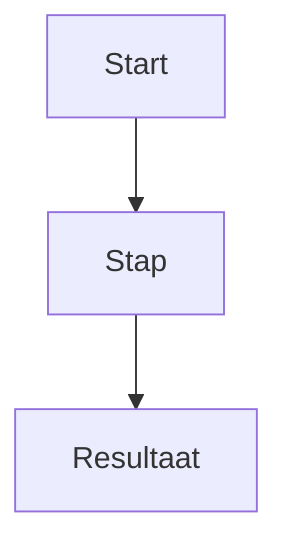

# [Appnaam] — [Note title]

> Specialistische werknote. Link terug naar de Project Hub en houd alleen informatie bij die bij dit domein hoort.

**Project Hub:** [link](PASTE-HACKMD-LINK)  
**Status:** draft | active | stable | needs-review  
**Primaire agent:** ...  
**Laatste relevante update:** YYYY-MM-DD

## Doel van deze note

Welke vraag of welk onderdeel van de app wordt hier beheerd?

## Relevante inputs

- [Requirement / bron / andere note](PASTE-HACKMD-LINK)
- ...

## Feiten

- ...

## Hypotheses

- ...

## Huidige keuzes

- ...

## Uitwerking

...

## Diagram / flow

Gebruik alleen als visualisatie extra duidelijkheid geeft. Houd identifiers en termen gelijk aan requirements en Decision Log.

## Open vragen / conflicten

- ...

## Geraakte requirements / beslissingen

- FR-...
- DEC-...

## Handoff

**Wat is veranderd?**  
...

**Welke hypothese/beslissing is geraakt?**  
...

**Wat blijft onzeker?**  
...

**Volgende specialist:**  
...

**Concrete volgende vraag:**  
...